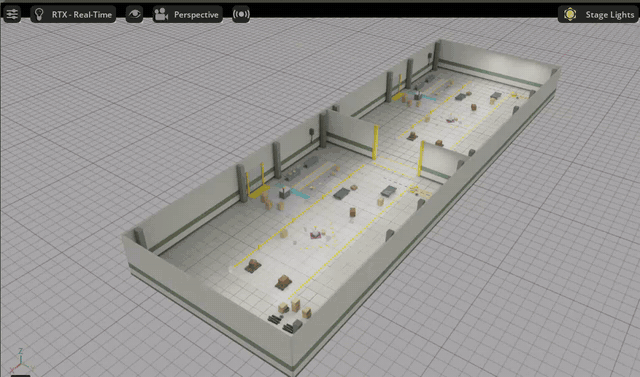
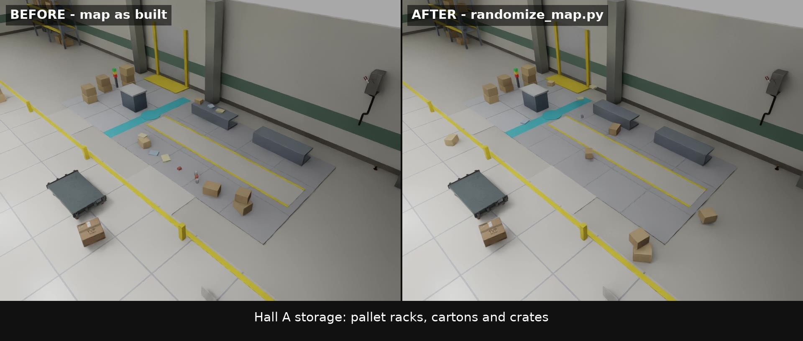

# twin-hall map



위는 `randomize_map.py` 실행 전(왼쪽)과 후(오른쪽)를 같은 카메라로 비교한 장면입니다.

### ▶ 전체 영상 (YouTube)

[](https://youtu.be/JdJChk__7Is)

위 이미지를 누르면 YouTube에서 재생됩니다 — https://youtu.be/JdJChk__7Is

같은 크기의 창고 홀 두 개를 X 방향으로 이어붙이고, 맞닿은 벽 가운데를 폭 5 m로
뚫어 통로를 낸 Isaac Sim 맵입니다. 로봇은 들어 있지 않습니다. 이동 로봇을 직접
스폰해서 쓰시면 됩니다.

## 치수

| | 값 |
|---|---|
| 홀 하나 | 26.30 × 16.55 m, 벽 높이 4.0 m |
| 전체 | 52.60 × 16.55 m |
| 통로 | 폭 5.0 m, 공유 벽 x = 21.80, 중심 y = −4.30 |
| 주 통로(아일) | 폭 6.0 m, 중심 y = −4.30 |
| 단위 / 상방 | meter / Z-up |

통로는 양쪽 홀의 주 통로 중심선에 맞춰 뚫려 있어, 홀 A의 아일에서 홀 B의 아일까지
꺾지 않고 통과할 수 있습니다. 통로 안에는 문턱도 콜라이더도 없습니다.

## 실행

Isaac Sim GUI로 맵을 엽니다.

```
./open_map.sh
```

Isaac Sim이 다른 경로에 있으면 파이썬 실행기를 지정하시면 됩니다.

```
ISAACSIM_PY=/path/to/python ./open_map.sh
```

터미널에 `[open_map] prims on stage: 1080` 이 찍히면 정상입니다. 프롭을 참조로
가져오므로 숫자는 에셋 로딩 상태에 따라 조금 달라질 수 있습니다.

## 맵 다시 만들기

`twin_hall_map.usd` 는 저장소에 들어 있으므로 그대로 열어 쓰셔도 됩니다. 치수나
통로 폭을 바꾸려면 다시 생성하십시오. Isaac Sim 없이도 됩니다.

```
pip install usd-core
python build_twin_hall_map.py -o twin_hall_map.usd
```

| 옵션 | 설명 |
|---|---|
| `--gap 3.0` | 통로 폭 (m). 기본 5.0 |
| `--no-assets` | NVIDIA 창고 프롭을 빼고 프리미티브만으로 생성 |
| `--assets-root URL` | Isaac 에셋 루트 지정. 기본은 공개 CDN |

스크립트를 Isaac Sim의 Script Editor에 그대로 붙여 넣어도 됩니다. 그 경우 열려
있는 스테이지에 바로 지어집니다.

## 스테이지 구조

| 프림 | 내용 |
|---|---|
| `/World/TwinHall/Hall_A` | 홀 본체 |
| `/World/TwinHall/Hall_B` | Hall_A를 X로 +26.30 m 옮긴 복사본. 배치는 아래대로 다릅니다 |
| `/World/TwinHall/Junction` | 공유 벽(통로 위아래 두 구간) + 문설주 + 바닥 표시 |
| `/World/TwinHall/PhysicsScene` | 중력 −Z 9.81 |
| `/World/TwinHall/Dome` | 앰비언트 돔 라이트 |

홀 안에는 주 통로와 작업 구역 도색, 뒤쪽 좁은 지름길(낮은 턱으로 막힘), 창고 구역
(3단 파렛트 랙 + 크레이트 더미), 구석에 놓인 랙 한 조, 피킹 베이(선반 위와 바닥에
흩어놓은 상자·캔·파우치), 팩존과 핸드오버 표시, 주 통로를 막고 선 고장 유닛, 기둥과
조명이 있습니다. 조립 스테이션과 컨베이어는 없습니다.

랙은 3단이며 각 단과 바닥 칸에 종이박스와 개방형 플라스틱 크레이트가 섞여 실려
있습니다. 통로 진입선과 주 통로에서 떨어진 벽면·구석에만 배치했습니다.

두 홀의 배치는 같지 않습니다. Hall_B는 Hall_A를 옮겨 복사한 뒤 아래를 바꿨습니다.

| 대상 | Hall_A | Hall_B |
|---|---|---|
| 피킹 베이 | 있음(선반 + 흩어진 화물) | 없음. 그 자리는 빈 바닥 |
| 창고 구역(랙 2열 + 적재물) | 북동쪽 구석 | 남동쪽 구석 |
| 구석 랙 한 조 | 남쪽 벽면 | 북동쪽, 창고가 있던 자리 |
| 고장 유닛 | 아일 중앙에서 동쪽 | 서쪽으로 6 m 이동 |
| 대차·적재물 일부 | — | 위치 변경 |

## 물건 배치 섞기

`randomize_map.py` 는 맵의 낱개 물건만 다시 배치합니다. 벽·기둥·랙 프레임·선반·
바닥 도색·통로 같은 구조물은 건드리지 않습니다.

Isaac Sim에서 맵을 연 상태로 Window > Script Editor 에 붙여 넣고 실행하면 열려 있는
스테이지가 그 자리에서 바뀌고, 콘솔에 전후 좌표표가 찍힙니다.

```
[randomize_map] before -> after
  item                          was (x, y, z)           now (x, y, z)         change
  Hall_A/Storage/Stock0         ( 16.28,   1.95, 0.53)  ( 14.98,   2.41, 0.53)  moved
  Hall_A/Products/Vac_2         ( 15.70,  -0.35, 0.06)  -                      removed
  ...
[randomize_map] 106 items: 93 moved (82 turned, 3 stacked), 12 removed, 1 kept
```

파일로 돌리려면 이렇게 하십시오.

```
python randomize_map.py twin_hall_map.usd -o shuffled.usd
```

한 물건에 일어나는 변화는 네 가지입니다.

| 변화 | 내용 |
|---|---|
| 이동 | 랙 화물은 원래 얹혀 있던 단 안에서, 바닥 물건은 원래 자리 반경 2 m 안에서 |
| 회전 | 바닥 물건은 자유롭게, 랙 화물은 ±9°까지만 |
| 쌓임 | 가끔 바닥이 아니라 다른 물건 위에 얹힘 |
| 사라짐 | 가끔 장면에서 아예 빠짐(prim 비활성화). 다시 실행하면 되살아난 뒤 다시 섞입니다 |

겹치게 놓지 않으며, 통로와 그 진입선에는 아무것도 놓지 않습니다. `--seed 7` 로 같은
배치를 재현하고, `--jitter` 로 이동 반경을, `--remove` 로 사라질 확률을 조절합니다.

물리: 바닥·벽·기둥·랙·선반·고장 유닛은 정적 콜라이더이고, 크레이트와 낱개 물품은
리지드 바디입니다. Play를 누르면 떨어지거나 밀립니다.

## 환경

| | 버전 |
|---|---|
| Isaac Sim | 5.1.0 (pip) — 맵을 여는 데 필요 |
| usd-core | 26.08 — 맵을 생성하는 데만 필요 |
| Python | 3.11 |

## 알아두실 점

랙·팔레트·박스 같은 프롭은 NVIDIA Isaac 에셋을 https로 참조합니다. Isaac Sim에서는
내려받아 표시되지만, usdview 등 일반 USD 뷰어에서는 빠진 채로 열립니다. 프롭 없이
완전히 자립적인 파일이 필요하시면 `--no-assets` 로 생성하십시오.

`SimulationApp` 으로 직접 여실 때는 `create_new_stage` 를 False로 주셔야 합니다.
기본값이 True라 `open_usd` 로 연 스테이지를 빈 스테이지로 덮어씁니다.

```python
app = SimulationApp({"headless": False,
                     "open_usd": "twin_hall_map.usd",
                     "create_new_stage": False})
```

시맨틱 라벨(floor, wall, crate, goods_box 등)은 Isaac Sim 안에서 생성했을 때만
붙습니다. usd-core 단독 실행에서는 라벨 없이 지오메트리만 생성됩니다.
